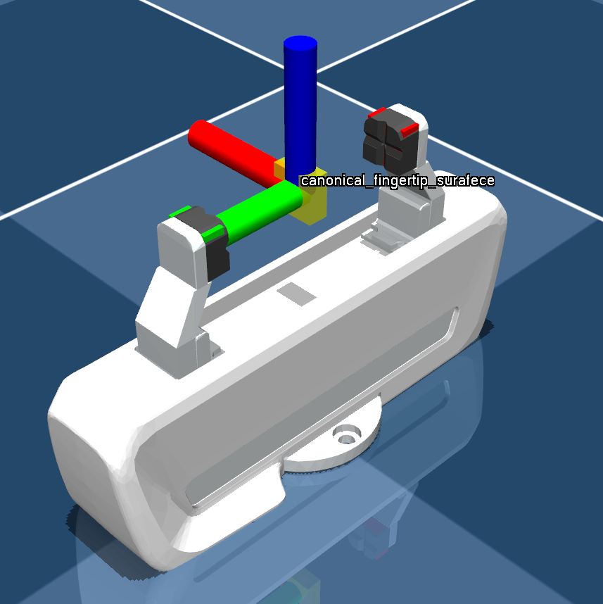
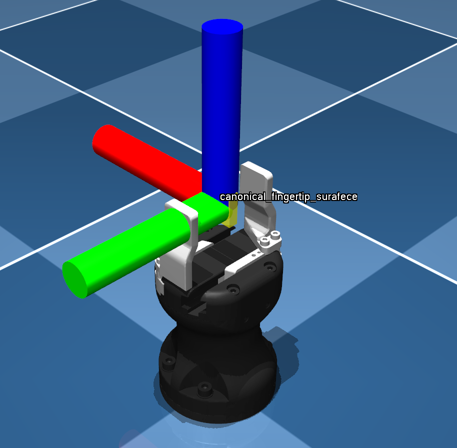
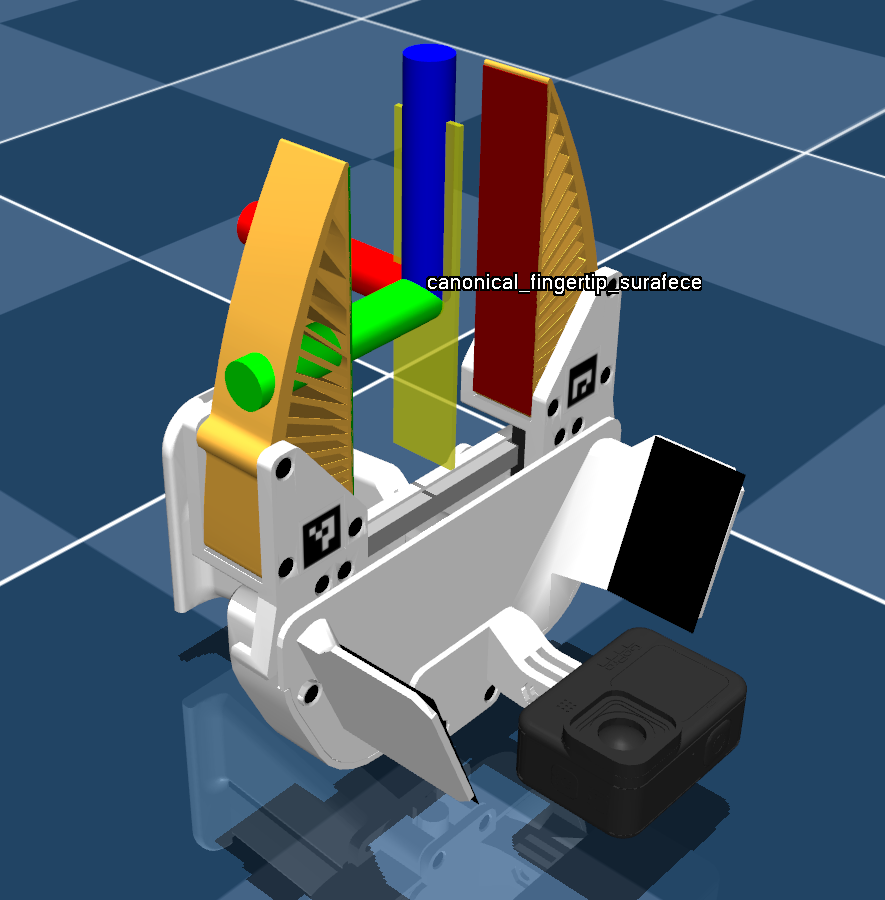
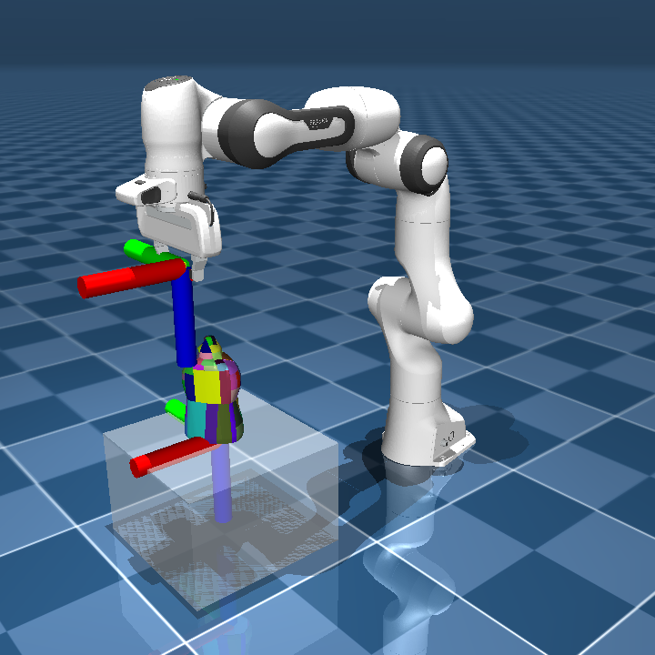
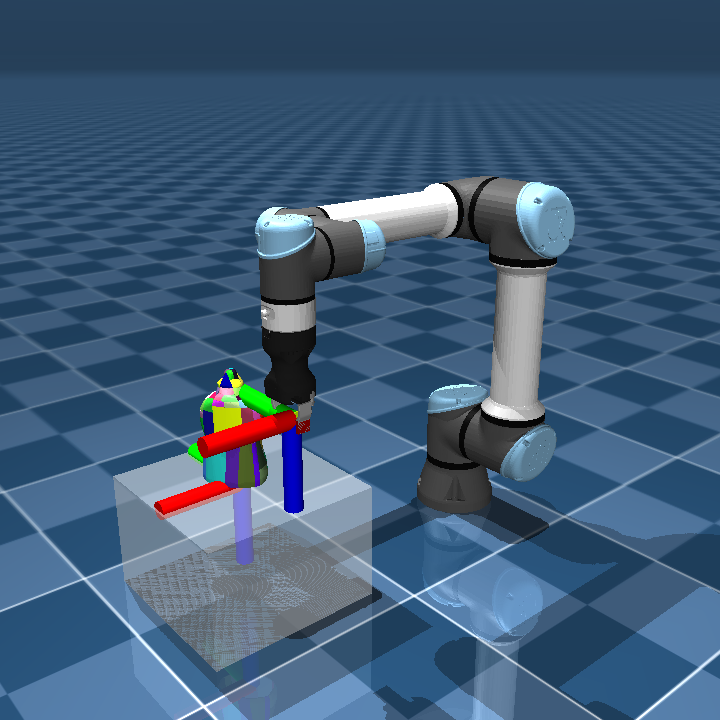
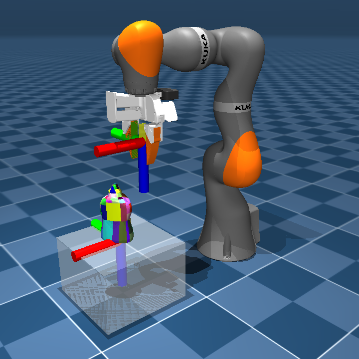
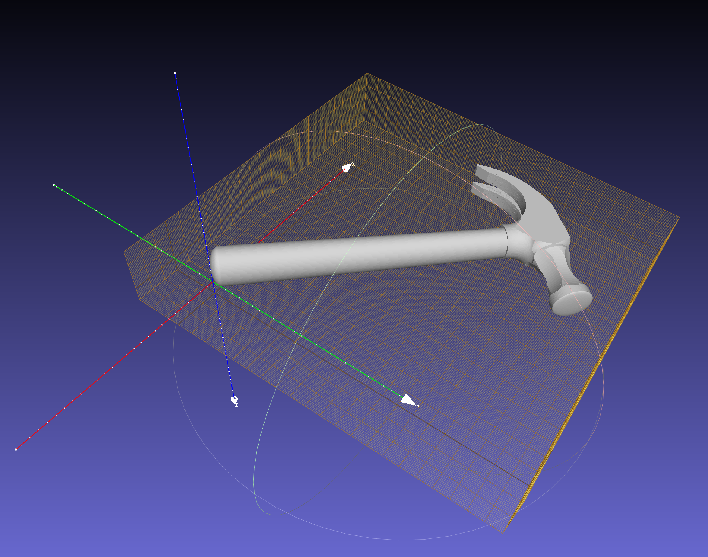
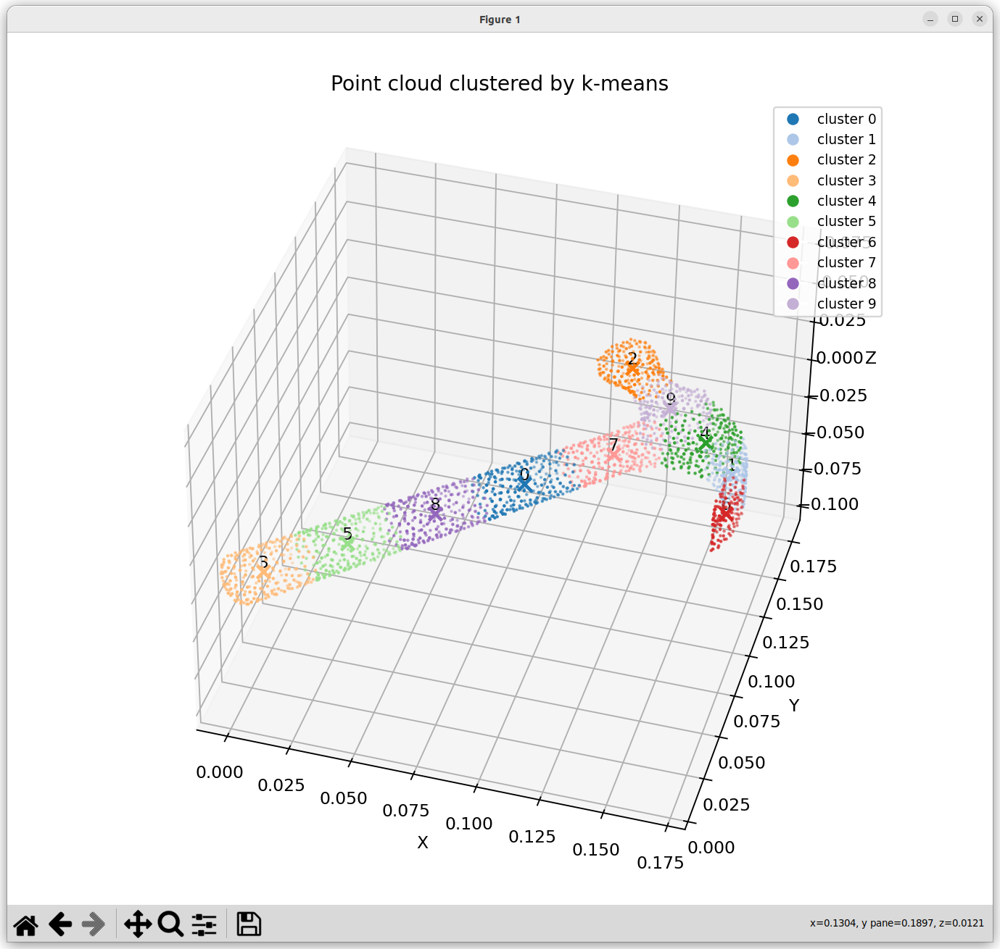
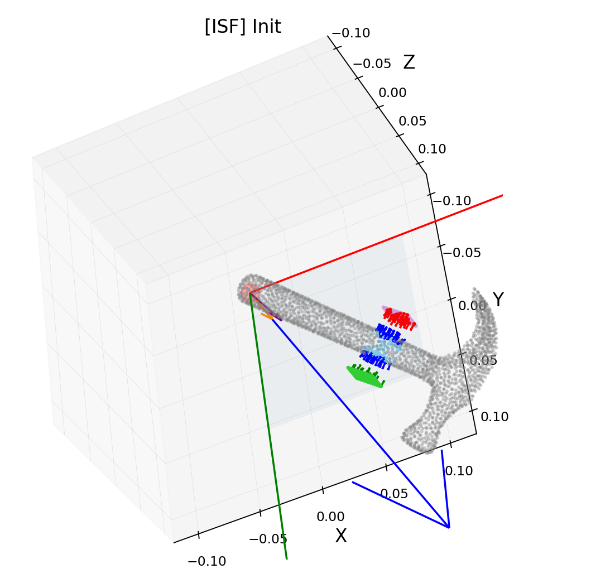
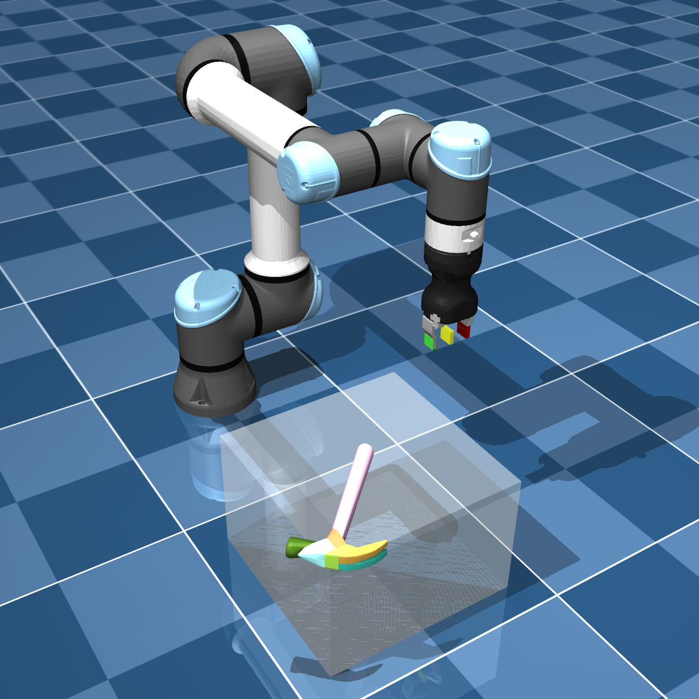

# Official implementation of Disentangled Iterative Surface Fitting (DISF) with journal extended vesion


<p align="center">
  
  
  
</p>

## Overview

This is the official implementation for the paper entitled with
"DISF: Disentangled Iterative Surface Fitting for Contact-stable Grasp Planning with Grasp Pose Alignment to the Object Center of Mass"

- Project page: https://tomoya-yamanokuchi.github.io/disf-ras-project-page/


## Relationship with our previous version
This repository is the extended version of our previous [conference_version].

Most of implementation, therefore, is forked from there.

- Previous Project page: https://tomoya-yamanokuchi.github.io/disf-project-page/


## 1-1. Preparation for docker run

make `data` directory in local envieonment to save data from DISF

```bash
cd ~ & mkdir data
```

## 1-2. Buld and run docker environment

```bash
cd ~
git clone https://github.com/tomoya-yamanokuchi/disf.git
cd ./disf
sh buld.sh
sh run.sh
```

## 2. Install packages with setup.py

The below procedures will be conducted inside the docker.

```bash
pip install -e .
```

## 3. Download YCB object dataset

```bash
python scripts/download_ycb_dataset.py
```

## 4. Apply pre-convex shape approximation

We use [CoACD] for pre-convex shape approximation inside the
[obj2mjcf].

Initial setup and check:
```bash
cd ~/disf/src/obj2mjcf/ & pip install -e .
ls /home/cudagl/.local/bin/obj2mjcf
export PATH=$PATH:/home/cudagl/.local/bin
obj2mjcf --help
```

Apply pre-convex shape approximation:

```bash
cd ~/disf/scripts/ & ./pre_convex_shape_approximation.sh
```

## 4. Grasp Planngin by DISF

We use [MuJoCo] as simulartor and use Franka Emika Panda environment from [MuJoCo Menagerie] for the grasp experiments.

You can try the grasp planning by `DISF`, `VISF` or `CMA-ES`:

```bash
python ~/disf/test/disf_grasp.py
python ~/disf/test/visf_grasp.py
python ~/disf/test/cma_grasp.py
```

## Parameter Settings

You can change the experimental settings by changing parameters in the config files: `disf/src/config_loader/config`

```
config:
 - env              # mujoco simulation parameters
 - grasp_evaluation # grasp evaluation parameters for position and orientation
 - icp              # ICP filtering parameter
 - ik_solver        # inverse kinematics parameters for robot arm reaching
 - isf              # DISF/ISF related parameters
 - cma              # CMA-ES related parameters
 - point_cloud_data # data loading parameters for YCB-object point cloud data
```

## Try your Customized Gripper!

### 1)  Define your gripper with the consistent local frame
ISF assume a specific gripper local frame. Thus, we need to fine our customized gripper with the consistent local frame in simulator. You can set the local frame as follows:

#### gripper local frame
<p>
    
    
    
</p>

#### gripper frame when it is attached to robot end effector
<p>
    
    
    
</p>


### 2) Define canonical gripper surface on the gripper base of XML
The second step you have to do is to set the new body, `canonical_fingertip_surafece`, at the appropriate place where the pose is consistnt with the canonical fingertip surafece of ISF planning space except fot the transration along with the gripper aperture dirextion:

```xml
<body name="canonical_fingertip_surafece" pos="x1 y1 z1">
    <site class="canonical_fingertip_surafece_site" name="canonical_fingertip_surafece"/>
</body>
```

where `canonical_fingertip_surafece_site` is defined in the default setting of XML file as follows.

```xml
<default class="canonical_fingertip_surafece_site">
    <site type="box" size="x_pad y_pad z_pad" pos="x2 y2 z2 " rgba="1 1 0 0.5"/>
</default>
```

Plese set the adequate positon parameter:

 - pos="x1 y1 z1": same as fingertip geom parent body
 - pos="x2 y2 z2": same as fingertip geom in default class of it
 - size="x_pad y_pad z_pad": size of the fingertip pad


By doing this procedures, Mujoco can compute the robot pose to match its site with the taregt site via inverse kinematics solver (IK solver).


### 3)  Set slide joint to your gripper and ensure consistent axis and range

example of slide joint settitng in default tag in XML:

```xml
    <default class="finger">
    <joint axis="1 0 0" type="slide" range="0 0.04"/>
    </default>
```

example of slide joint attachment to the finger of gripper in XML:

```xml
    <body name="hand" pos="0 0 0.107" quat="0.9238795 0 0 -0.3826834">
        ....

        <body name="left_finger" pos="0 0 0.0584">
        <inertial mass="0.015" pos="0 0 0" diaginertia="2.375e-6 2.375e-6 7.5e-7"/>
        <joint name="finger_joint1" class="finger"/>
        ....

        <body name="right_finger" pos="0 0 0.0584" quat="0 0 0 1">
        <inertial mass="0.015" pos="0 0 0" diaginertia="2.375e-6 2.375e-6 7.5e-7"/>
        <joint name="finger_joint2" class="finger"/>
        ....
```

# Custom Object Grasping

## (1) prepare your custom stl file

1. make `models` directory under the project root :  `disf_ras/models`.
2. make single object level directory for post_processing by [obj2mjcf]: e.g. `disf_ras/models/Hammer`.
3. set your custom stl file into the directory: `disf_ras/models/Hammer/Hammer.stl`.
4. make a copy of original stl with modified name as `textured.stl`:

```
disf_ras/
    - models/
        - Hammer/
            - Hammer.stl
            - textured.stl (copied from Hammer.stl)
```


## (2) align the pose for the grasp planning with some tools.
We assume the object pose is alighed with the grasp planning space for canonical gripper surface. Thus please edit the pose using the off-thr-shelf tool such as [MeshLab].

1. load your `textured.stl` int the MeshLab by drag and drop
2. edit rotation and translation of object consistent with the grasp planning space (canonical gripper surface frame).

<p>
    
</p>


### (3) generate collision objects and XML file for simulation

Then you can generate the pose aligned collision object for physics-simulator, such as Mujoco, by using by using [obj2mjcf].
After processing, you can confirm some generated collision objects (*.obj) and XML file (*.xml).
The number of collision objeect depends on the object stl model.


```
(in terminal at the directory of generated object)
-rw-r--r-- 1 user user  805 12月 9 10:13 textured.obj
-rw-r--r-- 1 user user  528 12月 9 11:25 textured.xml
-rw-r--r-- 1 user user 5383 12月 9 10:13 textured_collision_0.obj
-rw-r--r-- 1 user user 7029 12月 9 10:13 textured_collision_1.obj
```

### (4) generate initial grasp candidate position

We generate initial grasp candidate positions based on the k-means clusted centers.
Please run the following code with your desired object.
```
python scripts/grasp_candidate_generation/initial_translation_generation.py --object_name custom_Hammer
```

Then you can check the estimated clustered centers which you will be able to use for the initial translation parameter.

#### k-means clustere center values:

```
object_kmeans_centers (for config):
  # cluster 0
  [0.015177, 0.045214, -0.016954]


  # cluster 1
  [0.015095, 0.045163, -0.049358]


  # cluster 2
  [0.014755, 0.011469, -0.014467]


  # cluster 3
  [0.014996, 0.078873, -0.014875]

  --- (and so on...) ---
```

#### visualization of each center and colored whole object point cloud associated with clustere
<p>
    
</p>


In the above examle, each raw indicates each clustered center value (with the order of [x, y, z]), thus you can select whatever you want.


For example, if you chose the 1st raw center value, then you can set the parameter into the config of corresponding object.

e.g. ) in the case of `custom_Hammer.yaml`

```
 translation: [ 0.0560778   0.05576443 -0.0124667 ]
```


### (5) try grasp planning and evalute the planned grasp with simulator!

<p>
    
    
</p>


[CoACD]: https://github.com/SarahWeiii/CoACD
[obj2mjcf]: https://github.com/kevinzakka/obj2mjcf
[MuJoCo]: https://github.com/deepmind/mujoco
[MuJoCo Menagerie]: https://github.com/deepmind/mujoco_menagerie
[MeshLab]: https://www.meshlab.net/

[conference_version]: https://github.com/tomoya-yamanokuchi/disf-official
